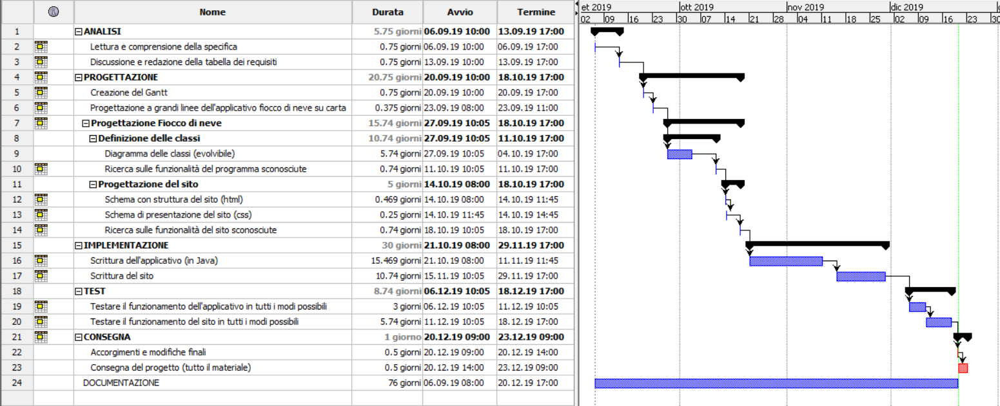
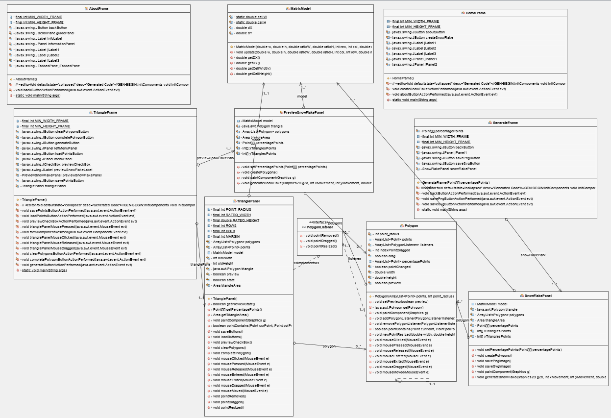
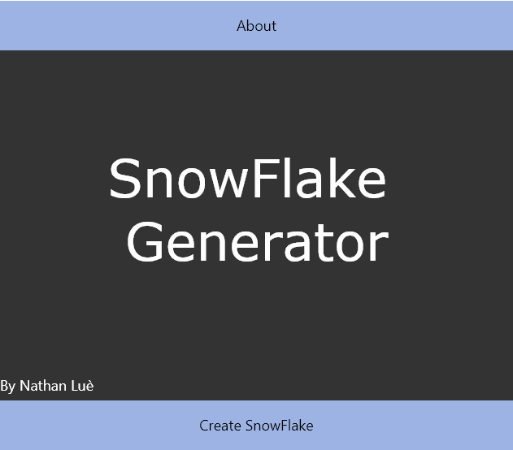
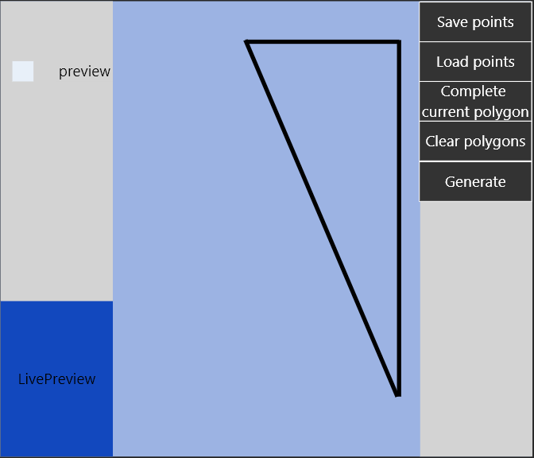
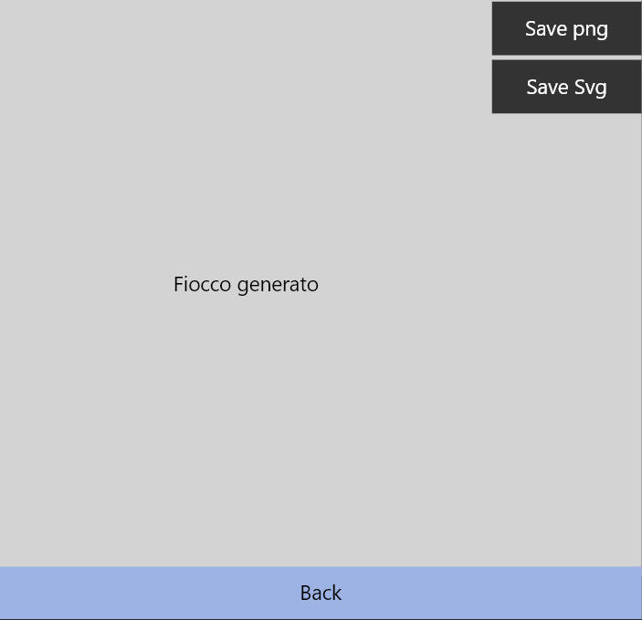
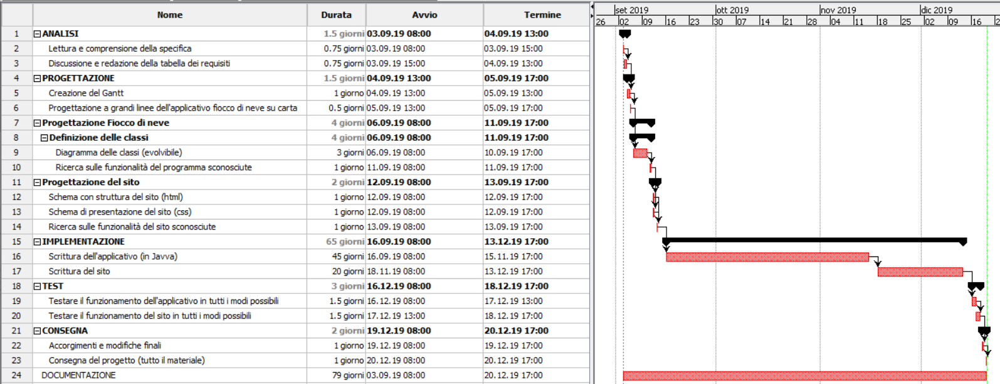

1. [Introduzione](#introduzione)

  - [Informazioni sul progetto](#informazioni-sul-progetto)

  - [Abstract](#abstract)

  - [Scopo](#scopo)

1. [Analisi](#analisi)

  - [Analisi del dominio](#analisi-del-dominio)
  
  - [Analisi dei mezzi](#analisi-dei-mezzi)

  - [Analisi e specifica dei requisiti](#analisi-e-specifica-dei-requisiti)

  - [Use case](#use-case)

  - [Pianificazione](#pianificazione)

1. [Progettazione](#progettazione)

  - [Design dell’architettura del sistema](#design-dell’architettura-del-sistema)

1. [Implementazione](#implementazione)

1. [Test](#test)

  - [Protocollo di test](#protocollo-di-test)

  - [Mancanze/limitazioni conosciute](#mancanze/limitazioni-conosciute)

1. [Consuntivo](#consuntivo)

1. [Conclusioni](#conclusioni)

  - [Sviluppi futuri](#sviluppi-futuri)

  - [Considerazioni personali](#considerazioni-personali)

1. [Allegati](#allegati)


## Introduzione

### Informazioni sul progetto

-   Allievo: Nathan Luè

-   Docenti coinvolti: Luca Muggiasca, Geo Petrini

-   Modulo 306, SAM Trevano I3AC

-   Durata progetto: 3 settembre 2019 - 20 dicembre 2019

### Abstract

  Nowadays it is difficult to find a program to create snowflakes. Thanks to this program it will be possible to do it for free. With the help of the software and all its features, you will be able to create real works of art. This program was conceived for creating snowflakes by cutting out and creating polygons inside a triangle (30, 60, 90). Then the triangle is "transformed" in different positions and a hexagon is created which represents the actual snowflake. You can create infinite variations of bows and have fun saving and reloading the saved points. <br>
  Boundless fun.

### Scopo

  Lo scopo di questo progetto didattico è quello di creare un applicativo che permetta, tramite dei "tagli" creati con il mouse, di creare un fiocco di neve. I "tagli" vengono effettuati all'interno di un triangolo. Inoltre vi è la possibilità di salvare il proprio lavoro per poterlo rivisualizzare in seguito. Vi sarà infine un sito che permette il download e l'informazione dell'applicativo.
  Lo scopo finale di questo progetto è quello di farci imparare a gestire un progetto completo.

## Analisi

### Analisi del dominio

  Questo prodotto sarà utilizzato per poter generare infiniti fiocchi di neve, esso può essere divertente per i più piccoli ma anche molto interessate per i più grandi. Esso può essere visto come un giochino, ma anche come oggetto di studio sulle infinite varietà di fiocchi di neve. Inoltre può essere usato come fonte di ispirazione nel campo artistico.

  Attualmente esistono software complicati che fanno quasi la stessa cosa di questo. Ma questo è molto semplice, intuitivo e ben spiegato. Ovviamente è un applicativo gratuito e multipiattaforma, scaricabile da tutti essendo scritto in Java.

  GLi utenti che possono utilizzare questo programma vanno da un età da asilo nido, fino ad un'età da casa per anziani. All'utente non è richiesta alcuna conoscenza specifica per utilizzare il software. Come detto in precedenza chiunque può divertirsi utilizzando questo software.

### Analisi e specifica dei requisiti

  |**ID**	|**Nome**			|**Priorità**|**Vers**|**Note**  |
  |----|------------|--------|----|------|
  |Req-1|L'applicativo deve essere scritto in Java.|1|1.0|-|
  |Req-2|Deve esistere un sito con la descrizione del software ed ove si può scaricare l'applicativo con una piccola guida legata al funzionamento dello stesso. Inoltre deve esserci una lista dei requisiti di sistema per poter avviare l'applicativo|1|1.0|-|
  |Req-3|Per la colorazione e l'abbellimento del sito evitare colori fastidiosi e rendere la pagina il più user-friendly possibile.|1|1.0|-|
  |Req-4|I tagli del triangolo devono essere fatti con il mouse tramite dei punti che si creano cliccando con il cursore.|1|1.0|-|
  |Req-5|Cliccando con il mouse si possono creare uno o più poligoni.|1|1.0|-|
  |Req-6|Deve esserci un'interfaccia grafica.|1|1.0|-|
  |Req-7|L'interfaccia deve poter essere ridimensionabile. La grandezza minima è 1024X768.|1|1.0|-|
  |Req-8|L'area di lavoro deve essere un triangolo.|1|1.0|-|
  |Req-9|Deve esistere il tasto genera fiocco, che genera appunto il fiocco.|1|1.0|-|
  |Req-10|La generazione del fiocco di neve deve avvenire in tempo reale.|2|1.0|Opzionale|
  |Req-11|I punti creati con il mouse devono poter essere spostati e rimossi.|2|1.0|Opzionale|
  |Req-12|Il lavoro (fiocco di neve) deve poter essere salvato.|1|1.0|-|
  |Req-13|Il salvataggio deve essere fatto in formato PNG o SVG (raster e vettoriale). La scelta viene proposta all'utente.|1|1.0|-|
  |Req-14|Il salvataggio deve avere dimensioni definite dall'utente tra 3 scelte: dimensione corrente, 500X500 o 1000X1000.|1|1.0|-|
  |Req-15|Deve essere possibile salvare i punti di taglio.|1|1.0|-|
  |Req-16|Il salvataggio del lavoro e dei punti deve venire effettuato su un file esterno. L'utente può scegliere la cartella di destinazione. Il file nel quale vengono salvate le informazioni è un file JSON.|1|1.0|-|
  |Req-17|All'avvio dell'applicativo deve essere mostrata una home che spiega come utilizzare il software.|1|1.0|-|
  |Req-18|I punti salvati possono venire caricati tramite un esplora risorse.|1|1.0|-|
  |Req-19|Il tasto salva fa visualizzare prima un anteprima del risultato e chiede conferma prima di salvare.|1|1.0|-|
  |Req-20|Il triangolo che deve venire tagliato deve ridimensionarsi in base alla dimensione della finestra (50%).|1|1.0|-|

### Use case

Il prodotto verrà utilizzato da una persona. Il progetto non prevede né connessioni ad internet, né connessioni a database. Quindi l'utente dialogherà solo e solamente con il programma.

### Pianificazione

#### *Gantt*
[Pianificazione Gantt(pdf)](./Gantt/GanttFioccoDiNeve.pdf)<br>
[Pianificazione Gantt(pod)](../../Gantt/Fiocco_di_neve.pod)

### Analisi dei mezzi

#### Software
Per realizzare questo progetto ho utilizzato i seguenti software:
)
* ProjectLibre - 1.9.1: Per la creazione del Gantt.
* NetBeans - 12.0.2: Per la scrittura di tutto il codice in java.
* JDK 12: Libreria per poter utilizzare java.
* json-simple-1.1.1: Questa libreria permette di utilizzare la struttura JSON per il salvataggio e la lettura di dati.
* Image-tracert - 1.1.1: Grazie a questa libreria è possibile salvare un'immagine vettoriale.

#### Hardware

Non ho dovuto creare o utilizzare macchine specifiche per svolgere o far "girare" il software.

Il progetto è stato realizzato su un PC portatile della Acer, con sistema operativo Windows 10.

## Progettazione

Il progetto è stato realizzato dopo aver svolto una accurata progettazione, dalla quale sono scaturite le seguenti informazioni:

### Design dell’architettura del sistema
L'architettura è composta da 9 classi:
* GenerateFrame
* AboutFrame
* HomeFrame
* MatrixModel
* Polygon
* PreviewSnowFlakePanel
* SnowFlakePanel
* TriangleFrame
* TrianglePanel<br>
E un'interfaccia:
* PolygonListener
#### *Diagramma delle classi (UML)*



#### *Diagramma delle classi ()
### Design delle interfacce

La pagina principale dovrà avere circa il seguente layout:



La generazione del fiocco avverrà in un frame a parte:



La generazione del fiocco completo avviene in GenerateFrame con la seguente grafica:



La sezione conterrà due tab. Uno per le informazioni, l'altro per la guida all'utilizzo del software.


## Implementazione

Il progetto è composto da diverse classi. Verranno riportate qui con i metodi più importanti e difficili da comprendere spiegati più nel dettaglio.

### **HomeFrame**
È la classe principale quando si avvia il programma, al suo interno vi è un menù iniziale composto da 2 bottoni (uno che porta all'about, mentre l'altro che porta nella finestra di creazione del fiocco [TriangleFrame]).

#### *Costruttore:*
All'interno del costruttore si specifica la dimensione minima del frame (1024x768), inoltre si imposta la dimensione corrente del frame (1024x768).
```java
    /**
     * Metodo costruttore della classe HomeFrame.
     * Al suo interno si setta la dimensione minima del frame su 1024x768.
     */
    public HomeFrame() {
        initComponents();
        this.setSize(MIN_WIDTH_FRAME, MIN_HEIGHT_FRAME);
        this.setMinimumSize(new Dimension(MIN_WIDTH_FRAME, MIN_HEIGHT_FRAME));
    }
```
#### *Bottone di salvataggio:*
Grazie a questo pulsante è possibile visualizzare il frame che permette di creare un fiocco tagliando un triangolo. Rende inoltre il frame attuale invisibile.
```java
    /**
     * Questo bottone rende visibile il frame per la creazione del fiocco.
     * 
     * @param evt Evento attivato.
     */
    private void createSnowFlakeActionPerformed(java.awt.event.ActionEvent evt) {   
        this.setVisible(false);
        (new TriangleFrame()).setVisible(true);
    }
```

### **AboutFrame**
È la classe che mostra le informazioni e la guida per l'utilizzo dell'applicazione. Molto semplicemente è composta da 2 tab. Nel primo vi sono le informazioni, nel secondo vi è la guida. La guida è realizzata in un label, ma scritta come html.
#### *Costruttore*

All'interno del costruttore si specifica la dimensione minima del frame (1024x768), inoltre si imposta la dimensione corrente del frame (1024x768).
```java
    /**
     * Metodo costruttore della classe AboutFrame.
     * Al suo interno si setta la dimensione minima del frame su 1024x768.
     */
    public AboutFrame() {
        initComponents();
        this.setSize(MIN_WIDTH_FRAME, MIN_HEIGHT_FRAME);
        this.setMinimumSize(new Dimension(MIN_WIDTH_FRAME, MIN_HEIGHT_FRAME));
    }
```

### **TriangleFrame**

È la classe che contiene i Panel che permettono di creare il fiocco di neve  e di visualizzare la preview.

#### *Costruttore:*

All'interno del costruttore si specifica la dimensione minima del frame (1024x768), inoltre si imposta la dimensione corrente del frame (1024x768).
```java
    /**
     * Metodo costruttore della classe TriangleFrame.
     * Al suo interno si setta la dimensione minima del frame su 1024x768.
     */
    public TriangleFrame() {
        initComponents();
        this.setSize(MIN_WIDTH_FRAME, MIN_HEIGHT_FRAME);
        this.setMinimumSize(new Dimension(MIN_WIDTH_FRAME, MIN_HEIGHT_FRAME));
    }
```
All'interno del frame vi sono più elementi:
* Un bottone per il salvataggio dei punti.
* Un bottone per il caricamento dei punti dei poligoni.
* Un bottone per il completamento automatico di un poligono.
* Un bottone per la cancellazione di tutti i poligoni.
* Un checkBox per rendere effettiva la preview.
* Un panel che permette di ritagliare il triangolo (TrianglePanel)
* Un panel che mostra l'anteprima live del fiocco di neve generato.

### **TrianglePanel**
È la classe che contiene il triangolo (30, 60, 90) ritagliabile. Dal quale si può poi ricavare il fiocco di neve.
#### *Costruttore:*
All'interno del costruttore si aggiungono i due listener legati agli eventi del mouse.
```java
    /**
     * Metodo costruttore della classe trianglePanel.
     * Al suo interno si aggiungono il mouseMotionListener ed il MouseListener.
     */
    public TrianglePanel(){
        this.addMouseListener(this);
        this.addMouseMotionListener(this);
    }
```
#### *Codice per l'apertura dell'esplora risorse alla selezione:*
Questo codice viene ripetuto molte volte all'interno del programma, serve appunto per poter effettuare il caricamento o i salvataggi dei punti tramite un esplora risorse.<br>
Si controlla che i poligoni non siano vuoti, dopodichè si specifica in quale directory bisogna trovarsi una volta aperto l'esplora risorse (in questo caso la cartella del programma). Dopodichè bisogna specificare il tipo di estensione voluta (in questo caso JSON) ed infine si controlla che l'utente abbia selezionato un file. In conclusione si ricava la path del file che l'utente ha scelto.
```java
    if(!this.polygons.isEmpty()){
        JFileChooser jfc = new JFileChooser("./");
        FileFilter ffJSON = new FileNameExtensionFilter("JSON", "json");
        jfc.setFileFilter(ffJSON);
        jfc.setAcceptAllFileFilterUsed(false);
        /*In questo caso è per salvare, se lo si vuole per aprire un file basta cambiare jfc.showSaveDialog(null) in jfc.showOpenDialog(null)*/
        int value = jfc.showSaveDialog(null);
        if(value == JFileChooser.APPROVE_OPTION){
            File filechosed = jfc.getSelectedFile();
            String path = filechosed.getAbsolutePath();
            ...
        }
    }
```
#### *Metodo getPercentagePoints:*
Questo metodo è fondamentale per il funzionamento del programma, egli infatti ritorna un array di Point contenete tutti i punti (in percentuale) di tutti i poligoni.
```java
    /**
     * Metodo getter per l'attributo percentagePoints.
     * 
     * @return L'attributo percentagePoints.
     */
    public Point[][] getPercentagePoints(){
        Point[][] polygonPercentagePoints = new Point[this.polygons.size()][];
        for(int i = 0 ; i < this.polygons.size() ; i++){
            polygonPercentagePoints[i] = new Point[this.polygons.get(i).percentagePoints.size()];
            for(int j = 0 ; j < this.polygons.get(i).percentagePoints.size() ; j++){
                polygonPercentagePoints[i][j] = this.polygons.get(i).percentagePoints.get(j);
            }
        }
        return polygonPercentagePoints;
    }
```
### **Polygon**
È la classe che rappresenta un modello astratto di poligono. Ogni volta che l'utente chiude un poligono nel TrianglePanel, quel poligono viene creato tramite la classe Polygon.
#### *Costruttore:*
All'interno del costruttore si assegnano i parametri agli attributi e si controlla che la dimensione dei punti sia maggiore o uguale a 3 (altrimenti non sarebbero poligoni). Il poligono si crea grazie ad un ArrayList di punti passata come parametro al costruttore.
```java
    /**
     * Costruttore della classe Polygon, al suo interno si ricava la lista di punti.
     * 
     * @param points I punti del poligono.
     * @param point_radius La dimensione del raggio dei punti del poligono.
     */
    public Polygon(ArrayList<Point> points, int point_radius){
        if(points.size() >= 3){
            this.points = points;
            this.point_radius = point_radius;
        }
    }
```
#### *Metodo newPointResized:*
Il metodo newPointResized viene richiamato ogni volta che vi è:
* Un ridimensionamento del frame.
* Un' eliminazione di un punto.
* Ogni volta che si crea un nuovo poligono.
<br>
Questo metodo calcola la percentuale dei punti rispetto all'altezza ed alla larghezza del frame nel momento della creazione del punto. Inoltre modifica le coordinate dei punti (points) in base appunto alla percentuale dei punti contenuti in percentagePoints.

```java
    /**
     * Calcola la percentuale di distanza nella finestra di ogni punto del poligono.
     * Utilizzato per il responsive dei punti.
     * 
     * @param width La larghezza della finestra.
     * @param height L'altezza della finestra.
     */
    public void newPointResized(double width, double height){
        this.width = width;
        this.height = height;
        if(pointChanged){
                this.percentagePoints.set(indexPointDragged, new Point((int)(this.points.get(indexPointDragged).getX() * 100 / width), (int)(this.points.get(indexPointDragged).getY() * 100 / height)));
                System.out.println(height);
                pointChanged = false;
        }
        for(int i = 0 ; i < this.points.size() ; i++){
            this.points.set(i, new Point(
                    (int)(this.percentagePoints.get(i).getX() / 100 * width), 
                    (int)(this.percentagePoints.get(i).getY() / 100 * height)
            ));
        }
        for(PolygonListener element : listeners){
            element.pointResized();
        }
    }
```
### **PreviewSnowFlakePanel**
È il panel che mostra una live preview del fiocco di neve. Essa è contenuta in TriangleFrame. Grazie ai percentagePoints passati dal TrianglePanel al TriangleFrame e poi di nuovo dal TriangleFrame al PreviewSnowFlakePanel è possibile generare un fiocco di neve fatto e finito.

#### *Metodo createPolygons*
Questo metodo permette di creare ed aggiungere alla lista polygons i poligoni che sono presenti nel TrianglePanel. Tramite i percentagePoints è possibile fare i punti responsive. 
```java
    /**
     * Si occupa di creare ed agiungere alla lista di polygons. I punti vengono salvati calcolando la percentuale.
     */
    public void createPolygons(){
        if(percentagePoints != null){
            polygons.clear();
            ArrayList<Point> polygonPoints = new ArrayList<>();
            for(int i = 0 ; i < this.percentagePoints.length ; i++){
                for(int j = 0 ; j < this.percentagePoints[i].length; j++){
                    polygonPoints.add(new Point(
                        (int)(this.percentagePoints[i][j].getX() * (double)this.getWidth() / 100), 
                        (int)(this.percentagePoints[i][j].getY() * (double)this.getHeight() / 100)
                    ));  
                }
                polygons.add(new Polygon((ArrayList<Point>)polygonPoints.clone(), TrianglePanel.POINT_RADIUS));
                polygonPoints.clear();
            }
        }
    } 
```

#### *Metodo generateSnowFlake*
Grazie a questo metodo è possibile ruotare il triangolo tagliato, in modo da formare un esagono, ovvero il fiocco di neve.
```java
    /**
     * Genera il fiocco di neve (6 triangoli ruotati).
     * 
     * @param g2d Oggetto grafico.
     * @param xMovement Spostamento sull'asse delle x.
     * @param yMovement Spostamento sull'asse delle y.
     * @param rateo Rapporto di grandezza.
     */
    public void generateSnowFlake(Graphics2D g2d, int xMovement, int yMovement, double rateo) {
        for (int i = 0; i < 6; i++) {
            AffineTransform tr2 = new AffineTransform();
            tr2.scale(rateo, rateo);
            tr2.translate(xMovement, yMovement);
            tr2.rotate(Math.toRadians(60) * i, this.xTrianglesPoints[2], this.yTrianglesPoints[2]);
            g2d.setTransform(tr2);
            g2d.fill(triangleArea);

            AffineTransform tr3 = new AffineTransform();
            tr3.scale(-rateo, rateo);
            tr3.translate((-this.xTrianglesPoints[2] * 2) - xMovement, yMovement);
            tr3.rotate(Math.toRadians(60) * i, this.xTrianglesPoints[2], this.yTrianglesPoints[2]);
            g2d.setTransform(tr3);
            g2d.fill(triangleArea);
        }
    }
```
### **SnowFlakePanel**
Questo panel rappresenta il vero e proprio fiocco generato. Essa è contenuta all'interno di GenerateFrame. Il suo funzionamento è pressochè identico a quello della classe precedente (previewSnowFlakePanel). Infatti al suo interno si trova il metodo generateSnowFlake scritto in maniera uguale se non per il rateo (che è aumentato per rendere più grande il fiocco).

#### *Metodo savePngImage:*
Questo metodo si occupa di salvare l'immagine in Png del fiocco. Per farlo lascia libera scelta all'utente sulla directory nella quale salvarla e sul nome da darle. Come visto in precedenza si utilizza la classe JFileChooser.<br>
Per creare l'immagine si utilizza la classe BufferedImage, nel costruttore di BufferedReader si specificano le dimensioni del'area da catturare ed il tipo di colore.
```java
    /**
     * Salva l'immagine del fiocco come png, la location di salvataggio viene scelta dall'utente. Così come il nome del file.
     */
    public void savePngImage(){
        try{
            JFileChooser jfc = new JFileChooser("./");
            FileFilter ffPng = new FileNameExtensionFilter("PNG", "png");
            jfc.setFileFilter(ffPng);
            jfc.setAcceptAllFileFilterUsed(false);
            int value = jfc.showSaveDialog(null);
            if(value == JFileChooser.APPROVE_OPTION){
                File filechosed = jfc.getSelectedFile();
                String path = filechosed.getAbsolutePath();
                File file = new File(path+".png");
                BufferedImage image = new BufferedImage(this.getWidth(), this.getHeight(), BufferedImage.TYPE_INT_RGB);
                this.paint(image.getGraphics());
                ImageIO.write(image, "png", file);
            }
        }catch(IOException ioe){
        }
    }
```
### **GenerateFrame**
È il frame che contiene lo SnowFlakePanel. Dentro il frame non vi è soltanto il Panel, ma ci sono anche due bottoni: 
* Uno per salvare l'immagine in Png (collegato al metodo SnowFlakePanel.savePngImage)
* Uno per salvare l'immagine in SVG (collegato al metodo SnowFlakePanel.saveSvgImage)

#### *Costruttore:*
Il costruttore ha come parametro un array bidimensionale di Point, così da poter passare le informazioni da TriangleFrame a questo Frame. L'array viene poi salvato in percentagePoints, che viene "dato in pasto" a SnowFlakePanel.<br>
Inoltre nel costruttore si definisce la grandezza del frame e si rende il tutto non ridimensionabile.
```java
    /**
     * Metodo costruttore della classe GenerateFrame.
     * 
     * @param percentagePoints I punti di tutti i poligoni sottoforma di percentuale.
     */
    public GenerateFrame(Point[][] percentagePoints) {
        initComponents();
        if(percentagePoints != null){
            this.percentagePoints = new Point[percentagePoints.length][];
            for(int i = 0 ; i < percentagePoints.length ; i++){
                this.percentagePoints[i] = new Point[percentagePoints[i].length];
                for(int j = 0 ; j < percentagePoints[i].length ; j++){
                    this.percentagePoints[i][j] = percentagePoints[i][j];
                }
            }
        }
        snowFlakePanel.setPercentagePoints(this.percentagePoints);
        this.setMinimumSize(new Dimension(MIN_WIDTH_FRAME, MIN_HEIGHT_FRAME));
        //Rende il frame non ridimensionabile.
        this.setResizable(false);
    }
```

### **MatrixModel**
È il modello che permette di mantenere il triangolo (in realtà qualsiasi elemento) sempre centrato e sempre ridimensionato in maniera corretta. In questo caso viene utilizzato sia per il triangolo nel TrianglePanel, ma anche per il fiocco di neve sia in PreviewSnowFlakePanel, che in SnowFlakePanel.
#### *Metodo update:*
Questo metodo fa il calcolo delle proporzioni e modifica gli attributi che vengono poi ritornati in un altro metodo. Questo metodo è fondamentale per la corretta centratura ed il ridimensionamento di tutti gli elementi all'interno del programma.
```java
    /**
     * Calcola le coordinate di origine e le dimensioni massime del disegno.
     *
     * @param w La larghezza totale della finestra.
     * @param h L'altezza totale della finestra.
     * @param ratioW Il rapporto di larghezza delle singole celle.
     * @param ratioH Il rapporto di altezza delle singole celle.
     * @param row Il numero di righe del disegno.
     * @param col Il numero di colonne del disegno.
     * @param margin La distanza minima da mantere dai bordi.
     */
    public void update(double w, double h, double ratioW, double ratioH, int col, int row, double margin) {
            double width = 0;
            double height = 0;
            if ((float)(w - 2 * margin) / (float)(h - 2 * margin) > (float)(col * ratioW) / (float)(row * ratioH)) {
                    dY = margin;
                    height = h - 2 * margin;
                    cellH = height / row;
                    cellW = cellH * ratioW / ratioH;
                    width = cellW * col;
                    dX = (w - width) / 2;
            } else {
                    dX = margin;
                    width = w - 2 * margin;
                    cellW = width / col;
                    cellH = cellW * ratioH / ratioW;
                    height = cellH * row;
                    dY = (h - height) / 2;
            }
    }
```

### **PolygonListener**
Questa interfaccia viene implementata da TriangleFrame per poter gestire gli eventi dei poligoni. Gli eventi sono:
* La cancellazione di un punto (pointRemoved)
* Il trascinamento di un punto (pointDragged)
* Il ridimenisonamento di un punto (pointResized);
#### *Metodi da implementare:*
```java
    /**
     * Notifica la rimozione di un punto.
     */
    public void pointRemoved();
    
    /**
     * Notifica il trascinamento di un punto.
     */
    public void pointDragged();
    
    /**
     * Notifica il ridimensionamento di un punto.
     */
    public void pointResized();
```
## Test

### Protocollo di test

|Test Case      | TC-001                               |
|---------------|--------------------------------------|
|**Nome**       |Download software. |
|**Riferimento**|REQ-002                               |
|**Descrizione**|Controllo che il software sia scaricabile dal sito. |
|**Prerequisiti**|Applicativo inserito nel sito e poento da scaricare. |
|**Procedura**     | Andare nel sito web dedicato a fiocco di neve, al tab download schiacciare download. |
|**Risultati attesi** |Il download parte senza problemi, l'applicativo una volta scaricato è funzionante. |
|**RIsultati effettivi**|Il download parte effettivamente senza problemi e l'applicativo si apre.|
---
---
|Test Case      | TC-002                               |
|---------------|--------------------------------------|
|**Nome**       |Creazione punti di taglio sul triangolo. |
|**Riferimento**|REQ-004                               |
|**Descrizione**|Controllo che cliccando con il mouse si creino dei punti per tagliare il triangolo. |
|**Prerequisiti**|Applicativo scaricato e apribile. |
|**Procedura**     | Recarsi nel TriangleFrame (ovvero dove si può tagliare il triangolo) ed iniziare a premere a caso fino a creare un poligono. |
|**Risultati attesi** |I punti si formano ed unendo il primo con l'ultimo si forma un poligono. |
|**RIsultati effettivi**|I punti si sono formati senza problemi e unendo il primo punto con l'ultimo si è formato il poligono.|
---
---
|Test Case      | TC-003                               |
|---------------|--------------------------------------|
|**Nome**       |Creazione di più poligoni. |
|**Riferimento**|REQ-005                               |
|**Descrizione**|Controllo che cliccando con il mouse, dopo aver creato un poligono, se ne possano creare altri.  |
|**Prerequisiti**|Applicativo scaricato e apribile. |
|**Procedura**     | Recarsi nel TriangleFrame (ovvero dove si può tagliare il triangolo) ed iniziare a premere a caso fino a creare un poligono. Dopodichè provare a schiacciare ancora e provare a crearne un altro. |
|**Risultati attesi** |Si creano più poligoni. |
|**RIsultati effettivi**|Si creano più poligoni, ma ovviamente prima di poterne creare un altro bisogna chiudere quello che si sta facendo.|
---
---
|Test Case      | TC-004                               |
|---------------|--------------------------------------|
|**Nome**       |Esistenza di un'interfaccia grafica. |
|**Riferimento**|REQ-006                               |
|**Descrizione**|Controllo che avviando il programma vi sia un'interfaccia grafica  |
|**Prerequisiti**|Applicativo scaricato e apribile. |
|**Procedura**     | Aprire il programma e girovagare un po' all'interno di esso. |
|**Risultati attesi** |L'interfaccia grafica c'è e funziona. |
|**RIsultati effettivi**|L'interfaccia grafica funziona perfettamente.|
---
---
|Test Case      | TC-005                               |
|---------------|--------------------------------------|
|**Nome**       |Interfaccia ridimensionabile, grandezza minima 1024x768. |
|**Riferimento**|REQ-007                               |
|**Descrizione**|Controllo che avviando il programma l'interfaccia grafica sia ridimensionabie, ma non sotto le dimensioni di 1024x768  |
|**Prerequisiti**|Applicativo scaricato e apribile. |
|**Procedura**     | Aprire il programma e girovagare un po' all'interno di esso e cercare di misurare la dimensione minima. |
|**Risultati attesi** |L'interfaccia grafica si può ridimensionare ma non sotto la dimensione prestabilita |
|**RIsultati effettivi**|L'interfaccia grafica si ridimensiona ma non sotto la dimensione prestabilita, quindi funziona.|
---
---
|Test Case      | TC-006                               |
|---------------|--------------------------------------|
|**Nome**       |Area di lavoro: triangolo. |
|**Riferimento**|REQ-008                               |
|**Descrizione**|Controllo che l'area di lavoro sia su un triangolo  |
|**Prerequisiti**|Applicativo scaricato e apribile. |
|**Procedura**     | Aprire il programma e recarsi nel TriangleFrame, per la creazione del fiocco. Assicurarsi che l'area di lavoro sia un triangolo. |
|**Risultati attesi** |L'area di lavoro è un triangolo |
|**RIsultati effettivi**|L'area di lavoro è effettivamente un triangolo.|
---
---
|Test Case      | TC-007                               |
|---------------|--------------------------------------|
|**Nome**       |Tasto genera fiocco che genera il fiocco |
|**Riferimento**|REQ-009                               |
|**Descrizione**|Controllo che vi sia un tasto che genera il fiocco e che venga generato  |
|**Prerequisiti**|Applicativo scaricato e apribile. |
|**Procedura**     | Aprire il programma e recarsi nel TriangleFrame, per la creazione del fiocco. Creare dei poligoni e premere su genera. |
|**Risultati attesi** |Il fiocco viene generato |
|**RIsultati effettivi**|Il fiocco viene generato correttamente in un'altra finestra.|
---
---
|Test Case      | TC-008                               |
|---------------|--------------------------------------|
|**Nome**       |Tasto genera fiocco che genera il fiocco |
|**Riferimento**|REQ-010                               |
|**Descrizione**|Controllo che la generazione del fiocco avvenga in tempo reale |
|**Prerequisiti**|Applicativo scaricato e apribile. |
|**Procedura**     | Aprire il programma e recarsi nel TriangleFrame, per la creazione del fiocco. Creare dei poligoni e premere su genera e vedere cosa succede nel PreviewSnowFlakePanel. |
|**Risultati attesi** |Il fiocco viene generato in tempo reale |
|**RIsultati effettivi**|Il fiocco viene effettivamente generato in tempo reale.|
---
---
|Test Case      | TC-009                               |
|---------------|--------------------------------------|
|**Nome**       |Rimozione e spostamento punti |
|**Riferimento**|REQ-011                               |
|**Descrizione**|Controllo che i punti possano essere spostati e rimossi |
|**Prerequisiti**|Applicativo scaricato e apribile. |
|**Procedura**     | Aprire il programma e recarsi nel TriangleFrame, per la creazione del fiocco. Creare dei poligoni e premere su un punto e trascinarlo. Dopodiché premere tasto destro su un punto. |
|**Risultati attesi** |Il punto si sposta e viene eliminato |
|**RIsultati effettivi**|Il punto si sposta e viene effettivamente eliminato|
---
---
|Test Case      | TC-010                               |
|---------------|--------------------------------------|
|**Nome**       |Salvataggio fiocco di neve. |
|**Riferimento**|REQ-012                               |
|**Descrizione**|Controllo che il fiocco di neve si possa salvare |
|**Prerequisiti**|Applicativo scaricato e apribile. |
|**Procedura**     | Aprire il programma e recarsi nel TriangleFrame, per la creazione del fiocco. Creare dei poligoni e creare il fiocco con il tasto genera. Premere su salva Png. |
|**Risultati attesi** |Il fiocco viene salvato in un immagine |
|**RIsultati effettivi**|Il fiocco viene salvato in un immagine Png|
---
---
|Test Case      | TC-011                               |
|---------------|--------------------------------------|
|**Nome**       |Salvataggio fiocco di neve in Png e Svg. |
|**Riferimento**|REQ-013                               |
|**Descrizione**|Controllo che il fiocco di neve si possa salvare sia in Png che in Svg e che la scelta venga proposta all'utente |
|**Prerequisiti**|Applicativo scaricato e apribile. |
|**Procedura**     | Aprire il programma e recarsi nel TriangleFrame, per la creazione del fiocco. Creare dei poligoni e creare il fiocco con il tasto genera. Premere su salva Png. Rieseguire la stessa operazione ma premendo su salva Svg. |
|**Risultati attesi** |Il fiocco propone il formato, dopodiché viene salvato o in Png, o in Svg |
|**RIsultati effettivi**|Il fiocco viene salvato in un'immagine Png, pure in una Svg però l'immagine vettoriale viene spostata e salvata in maniera imprecisa. Vi sono due bottoni, quindi la scelta è funzionante|
---
---
|Test Case      | TC-012                               |
|---------------|--------------------------------------|
|**Nome**       |Dimensioni salvataggio definite dall'utente |
|**Riferimento**|REQ-014                               |
|**Descrizione**|Controllo che il fiocco di neve si possa salvare sia in Png che in Svg con la triplice scelta per l'utente (500x500 o 1000x1000 o dimensione corrente) |
|**Prerequisiti**|Applicativo scaricato e apribile. |
|**Procedura**     | Aprire il programma e recarsi nel TriangleFrame, per la creazione del fiocco. Creare dei poligoni e creare il fiocco con il tasto genera. Premere su salva Png. Rieseguire la stessa operazione ma premendo su salva Svg. |
|**Risultati attesi** |Il fiocco propone il formato con anche la dimensione, dopodiché viene salvato o in Png, o in Svg |
|**RIsultati effettivi**|Il fiocco viene salvato in un'immagine Png, ma l'unica dimensione che viene slavata è la corrente.|
---
---
|Test Case      | TC-013                               |
|---------------|--------------------------------------|
|**Nome**       |Salvataggio punti di taglio |
|**Riferimento**|REQ-015                               |
|**Descrizione**|Controllo che sia possibile salvare i punti di taglio del triangolo |
|**Prerequisiti**|Applicativo scaricato e apribile. |
|**Procedura**     | Aprire il programma e recarsi nel TriangleFrame, per la creazione del fiocco. Creare dei poligoni e schiacciare su save points. |
|**Risultati attesi** |Il programma propone dove salvare i punti e li salva |
|**RIsultati effettivi**|i punti vengono salvati in un file definito dall'utente correttamente.|
---
---
|Test Case      | TC-014                               |
|---------------|--------------------------------------|
|**Nome**       |Salvataggio punti di taglio in un JSON esterno a scelta |
|**Riferimento**|REQ-016                               |
|**Descrizione**|Controllo che sia possibile salvare i punti di taglio del triangolo in un file JSON esterno scelto dall'utente |
|**Prerequisiti**|Applicativo scaricato e apribile. |
|**Procedura**     | Aprire il programma e recarsi nel TriangleFrame, per la creazione del fiocco. Creare dei poligoni e schiacciare su save points. |
|**Risultati attesi** |Il programma propone dove salvare i punti e li salva nel formato JSON |
|**RIsultati effettivi**|i punti vengono salvati in un file definito dall'utente correttamente nel formato JSON.|
---
---
|Test Case      | TC-015                               |
|---------------|--------------------------------------|
|**Nome**       |Home Page che spieghi come utilizzare il software |
|**Riferimento**|REQ-017                               |
|**Descrizione**|Controllo che vi sia un home page che spieghi come utilizzare il software |
|**Prerequisiti**|Applicativo scaricato e apribile. |
|**Procedura**     | Aprire il programma e recarsi nel HomeFrame, schiacciare su about |
|**Risultati attesi** |Si apre una schermata con scritto le informazioni principali e le spiegazioni su come usare il programma |
|**RIsultati effettivi**|Si apre una schermata con 2 tab. In uno vi sono le informazioni del software. Nel secondo vi è la guida all'utilizzo dell'applicativo.|
---
---
|Test Case      | TC-016                               |
|---------------|--------------------------------------|
|**Nome**       |Punti caricati tramite esplora risorse |
|**Riferimento**|REQ-018                               |
|**Descrizione**|Controllo che i punti possano venire caricati tramite una sorta di esplora risorse |
|**Prerequisiti**|Applicativo scaricato e apribile. |
|**Procedura**     | Aprire il programma e recarsi nel TriangleFrame, dopodiché premere su load points e selezionare un file |
|**Risultati attesi** |Il programma fa scegliere il file e carica i punti |
|**RIsultati effettivi**|Il programma fa effettivamente scegliere i file, i dati vengono caricati correttamente.|
---
---
|Test Case      | TC-017                               |
|---------------|--------------------------------------|
|**Nome**       |Salva con anteprima |
|**Riferimento**|REQ-019                               |
|**Descrizione**|Controllo che dopo aver premuto genera vi sia un anteprima prima di salvare i punti|
|**Prerequisiti**|Applicativo scaricato e apribile. |
|**Procedura**     | Aprire il programma e recarsi nel TriangleFrame, creare dei poligoni e generare un fiocco. Premere su salva|
|**Risultati attesi** |Il programma mostra il fiocco e chiede se si vuole salvare |
|**RIsultati effettivi**|Il programma genera un fiocco di anteprima. Se l'utente lo gradisce può premere su salva e il fiocco verrà salvato. Altrimenti tramite il tasto back può tornare indietro e annullare il salvataggio|
---
---
|Test Case      | TC-018                               |
|---------------|--------------------------------------|
|**Nome**       |Triangolo sempre centrato |
|**Riferimento**|REQ-020                               |
|**Descrizione**|Controllo che il triangolo sia sempre centrato|
|**Prerequisiti**|Applicativo scaricato e apribile. |
|**Procedura**     | Aprire il programma e recarsi nel TriangleFrame e provare a ridimensionare la finestra|
|**Risultati attesi** |Il fiocco si ridimensiona e rimane sempre al centro |
|**RIsultati effettivi**|Il fiocco si ridimensiona e rimane sempre al centro.|

### Risultati test

|Test Case      | Risultato (riuscito / non riuscito / parzialmente riuscito)  |
|---------------|--------------------------------------|
|TC-001    |riuscito |
|TC-002    |riuscito |
|TC-003    |riuscito |
|TC-004    |riuscito |
|TC-005    |riuscito |
|TC-006    |riuscito |
|TC-007    |riuscito |
|TC-008    |riuscito |
|TC-009    |riuscito |
|TC-010    |riuscito |
|TC-011    |parzialmente riuscito |
|TC-012    |parzialmente riuscito |
|TC-013    |riuscito |
|TC-014    |riuscito |
|TC-015    |riuscito |
|TC-016    |riuscito |
|TC-017    |riuscito |
|TC-018    |riuscito |

### Mancanze/limitazioni conosciute
* Non sarà possibile salvare le immagini in diversi formati (500x500 o 1000x1000), sarà possibile salvarle solo nella dimensione corrente.
* Il responsive dei punti è da rivedere, ma i calcoli sembrerebbero giusti.

## Consuntivo

#### *Gantt consuntivo*
[Gantt consuntivo(pdf)](./Gantt/GanttFioccoDiNeveConsuntivo.pdf)<br>


## Conclusioni

Il programma finito non è proprio come me lo aspettavo e come l'avevo pianificato. Non posso lamentarmi perchè la maggior parte dei requisiti sono stati rispettati egregiamente. Lo scopo del progetto è stato rispettato e penso che il succo della materia mi sia entrato in testa. Per me questo è un successo.

### Sviluppi futuri
  Non penso che andrò avanti con il progetto al di fuori dei termini scolastici.

### Considerazioni personali
  Da questo progetto ho imparato a gestirne effettivamente uno. Ho capito che se una pianificazione viene presa sotto gamba, allora il progetto diventa molto più soggetto al fallimento. Penso di non aver fatto una buona pianificazione e ciò mi ha portato a fare cambiamenti su cose che avrei voluto fare.<br>
  Sicuramente il progetto non era semplicissimo, anzi era abbastanza complicato, penso di avere comunque nel complesso fatto un buon lavoro (più che altro lo spero).

## Allegati

-   Diari di lavoro

-   Codici sorgente
